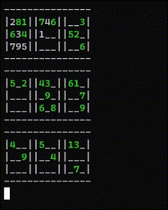

# sudoku.rs
Brute force algorithm for solving and making sudoku puzzles.

## Input File
Use underscores for blank spaces, see test.txt for an example.
 
## Solving
Goes through the grid and at a None value, it iterates through the possible numbers and then at the next None value it does the same,
if there is no possible numbers then it returns.

There is a seperate mode called hard check that solves the grid but continues to see if there is another solution, this is because a valid sudoku puzzle only has one solution. 
     
     cargo run solve <filename> 
This will solve the puzzle and print out the answer.

     --hard
This will use the hard check.

     --debug
This will print the grid at each stage of the solver.

## Checking
Checks if the grid is full and that all the values are correct.

     cargo run check <filename>

## Creating
This may take a while, it creates a new sudoku grid (difficulty options not a thing yet!)
If it takes too long then kill the process and do it again (don't ask why!)

     cargo run create
